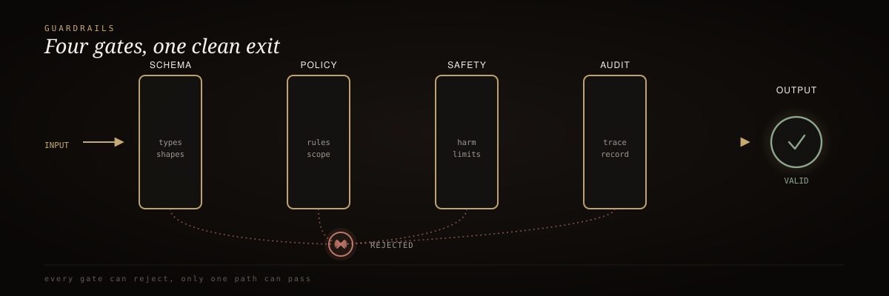

<div align="center">
  
</div>

<br/>

<div align="center">
  <h3>RIG-Enhanced Guardrails</h3>
  <p><em>LLM output validation where the "pass" is a signed artifact, not a boolean you trust.</em></p>
</div>

<div align="center">


</div>

<br/>

> 🥇 A `True`/`False` from a validator is just a boolean — nothing catches it if it's altered downstream. Here, a `Guard` seals its verdict into a signed **ProofPacket**, and an independent **Verifier** — one that never imports the Guard's logic — recomputes the claim from raw evidence before anyone trusts it.

This is an independent, from-scratch reimplementation of the [guardrails-ai/guardrails](https://github.com/guardrails-ai/guardrails) concept — not a fork — with one structural difference that changes everything downstream: **the validation decision is not a boolean you trust, it's a signed artifact you verify.**

## 60-second install

```bash
pip install -e .

export RIG_PROOF_HMAC_KEY="your-secret-key-here"

# Validate output and seal a ProofPacket
python3 -m src.guard --output "The forecast is mild with light wind." \
  --out packet.json

# Independently verify it — verify.py never imports guard.py
python3 -m src.verify packet.json
```

```python
from src.guard import Guard
from src.verify import Verifier

guard = Guard()          # loads RIG_PROOF_HMAC_KEY from the environment
verifier = Verifier()    # loads the same key independently

output = "The forecast is mild with light wind."
packet = guard.validate(output, input_text="what's the forecast?")

print(packet["status"])  # "green" or "red"

result = verifier.verify(packet, expected_output=output)
print(result.overall_valid)   # True only if signature + status + hash all check out
```

## How it works

<div align="center">
  
</div>

<sub align="center">LLM output → Guard seals HMAC-signed ProofPacket → independent Verifier recomputes signature, status, hash → overall_valid</sub>

Four checks run inside `Guard.validate()` on every call: **`json_schema`** (recursive structural validator), **`toxicity`** (lexicon/heuristic scorer), **`factuality`** (honestly-scoped placeholder for unverified absolute claims), and **`format`** (length, encoding, fence balance).

## Before / after

| | Standard guardrails | RIG-enhanced guardrails |
| :-- | :-- | :-- |
| What you get back | `True` / `False` | Signed **ProofPacket**: status, per-check results, hashes, timestamp, HMAC-SHA256 signature |
| Who decides "it passed" | The validator itself | An independent **Verifier** recomputes the claim from raw evidence |
| Result altered downstream | Nothing catches it | Any single-byte change breaks the HMAC signature |
| Validator has a logic bug | Silent | Caught — Verifier recomputes `status` independently and flags mismatches |
| Output swapped, "pass" reused | Possible | Blocked — `output_hash` binds the packet to exact output text |
| Failed validation | Exception or bare `False` | A `red` ProofPacket — still signed, still independently verifiable |

## Benchmark

Single-threaded, CPython 3.11, Apple Silicon, 2,000-call average after warmup:

| Operation | Latency (avg) | Notes |
| :-- | --: | :-- |
| Four checks only (no proof sealing) | ~0.004 ms/call | What a standard boolean validator does |
| `Guard.validate()` — checks + hash + HMAC seal | ~0.010 ms/call | Full ProofPacket construction and signing |
| `Verifier.verify()` — signature + consistency + hash | ~0.005 ms/call | Independent re-check, no shared state |
| **Combined round trip** | **~0.015 ms/call** | **~67,000 round trips/sec, single thread** |
| ProofPacket size | ~750 bytes (JSON) | Trivial to store/replay |

<sup>The cost of proof-gating over a bare boolean is a small, constant HMAC + two SHA-256 hashes per validation — dwarfed by the LLM call the output came from.</sup>

## Why it exists

- **Builder ≠ Verifier** — the Guard and the Verifier are structurally separate; the Verifier never imports the Guard's logic
- **A failed check is still an authentic record** — a `red` packet is cryptographically signed and independently verifiable
- **Silent status bugs get caught** — the Verifier recomputes `status` from raw checks, not from what the packet claims
- **The audit record is the ProofPacket itself** — self-contained, tamper-evident, replayable

<details>
<summary><strong>Verification layers</strong></summary>

<br/>

- **`.rig/smoke.sh`** — L10 self-evolving smoke test across 8 scenarios (valid, toxic, tampered packet, swapped-output attack, wrong signing key, schema-invalid payload). Failures append to `.rig/hardening-log.md`.
- **`.rig/verify.sh`** — L8 eight-layer verification: syntax → unit → integration → eval → proof → gate → audit → sign-off.
- **`spec/features/proof-gated-validation.feature`** — OpenSpec/Gherkin executable behavior specs.
- **`test/test_guard.py`** — 16 pytest cases across valid, invalid, and tampered-packet scenarios, real cryptographic path, no mocking.

```bash
bash .rig/smoke.sh
bash .rig/verify.sh
python3 -m pytest test/test_guard.py -v
```

</details>

## Documentation

| Path | Role |
| :-- | :-- |
| [`AGENTS.md`](AGENTS.md) | TAC doctrine — Core Four, Builder≠Verifier, closed-loop architecture |
| [`src/proofpacket.py`](src/proofpacket.py) | Shared crypto primitives only |
| [`src/guard.py`](src/guard.py) | Builder — 4 checks + ProofPacket sealing |
| [`src/verify.py`](src/verify.py) | Verifier — independent signature + consistency + output-binding checks |
| [LICENSE](LICENSE) | MIT |

---

<div align="center"><sub>Built by Mike Rodgers · Forward Deployed Engineer · <a href="https://rodgersintelligence.com">rodgersintelligence.com</a></sub></div>
